# Trigger Map: algor

> The strategic North Star connecting business goals to user psychology.

**Document:** Trigger Map - Hub
**Created:** 2026-07-02
**Status:** COMPLETE

---

## Visual Overview

```mermaid
graph TD
    %% Styling
    classDef primaryGoal fill:#FFD700,stroke:#B8860B,stroke-width:2px,color:black
    classDef businessGoal fill:#E6F2FF,stroke:#4A90E2,stroke-width:1px
    classDef platform fill:#333333,stroke:#000000,stroke-width:2px,color:white
    classDef targetGroup fill:#D4EDDA,stroke:#28A745,stroke-width:1px
    classDef drivingForces fill:#FFF3CD,stroke:#FFC107,stroke-width:1px

    %% 1. BUSINESS GOALS
    BG0["<br/>⭐ PRIMARY: Generar Prospectos Calificados B2B (Leads)<br/>"]:::primaryGoal
    BG1["<br/>🚀 Elevación en la calidad de la conversación (Pre-educación)<br/>"]:::businessGoal
    BG2["<br/>🌟 Contratos a Largo Plazo (Igualas)<br/>"]:::businessGoal

    %% 2. PLATFORM
    P["<br/>💻 Sitio Web algor (Premium Tech Engineering)<br/>"]:::platform

    %% 3. TARGET GROUPS
    TG1["<br/>🧑‍💻 Gerente de TI (Buscador Bala de Plata)<br/>"]:::targetGroup
    TG2["<br/>👔 Propietario / Gerente Administrativo<br/>"]:::targetGroup

    %% 4. DRIVING FORCES - Gerente TI
    DF1_1["<br/>✅ Integración profunda automatizada<br/>"]:::drivingForces
    DF1_2["<br/>✅ Trato técnico de igual a igual<br/>"]:::drivingForces
    DF1_3["<br/>✅ Casos técnicos demostrados<br/>"]:::drivingForces
    DF1_4["<br/>❌ Vendehumos que no saben de servidores<br/>"]:::drivingForces
    DF1_5["<br/>❌ Romper el ERP en producción<br/>"]:::drivingForces
    DF1_6["<br/>❌ Costos inalcanzables corporativos<br/>"]:::drivingForces

    %% 4. DRIVING FORCES - Propietario
    DF2_1["<br/>✅ ROI y Eficiencia Operativa<br/>"]:::drivingForces
    DF2_2["<br/>✅ Confianza en un socio estratégico<br/>"]:::drivingForces
    DF2_3["<br/>✅ Entregas llave en mano a tiempo<br/>"]:::drivingForces
    DF2_4["<br/>❌ Proyectos infinitos sin retorno<br/>"]:::drivingForces
    DF2_5["<br/>❌ Incomprensión del lenguaje técnico<br/>"]:::drivingForces
    DF2_6["<br/>❌ Caída de su operación diaria<br/>"]:::drivingForces

    %% CONNECTIONS
    BG0 --> P
    BG1 --> P
    BG2 --> P

    P --> TG1
    P --> TG2

    TG1 --> DF1_1 & DF1_2 & DF1_3 & DF1_4 & DF1_5 & DF1_6
    TG2 --> DF2_1 & DF2_2 & DF2_3 & DF2_4 & DF2_5 & DF2_6
```

---

## How to Read This Map

El Trigger Map es el puente entre lo que el negocio necesita y lo que los usuarios desean. Todo fluye desde los objetivos comerciales hacia la plataforma, conectando luego con los grupos objetivo y finalmente con las fuerzas impulsoras subyacentes.

- **Primary Goal (El Motor):** Capturar prospectos altamente calificados B2B (Leads) resolviendo y validando sus dolores operativos a través del portafolio.
- **The Platform:** Un sitio web bajo una arquitectura B2B tradicional pero invirtiendo el enfoque hacia problemas reales y con una estética ingenieril profunda (Premium Tech Engineering).
- **Target Groups & Drivers:** Abordamos al Gerente de TI demostrándole nuestro nivel experto para evitar desastres operativos, mientras le mostramos al Dueño el ROI claro para garantizar su confianza a largo plazo.

---

## The Documents

Explora los documentos de la serie Trigger Map para obtener detalles completos sobre cada aspecto estratégico:

1. **[01-Business-Goals.md](01-Business-Goals.md)** - The Engine and the Flywheel.
2. **[02-Gerente-TI.md](02-Gerente-TI.md)** - Primary Persona (El Gatekeeper Técnico).
3. **[03-Propietario.md](03-Propietario.md)** - Secondary Persona (El Decisor Económico).
4. **[05-Key-Insights.md](05-Key-Insights.md)** - Strategic implications and priorities.
5. **[06-Feature-Impact.md](06-Feature-Impact.md)** - Prioritization of features and content.
