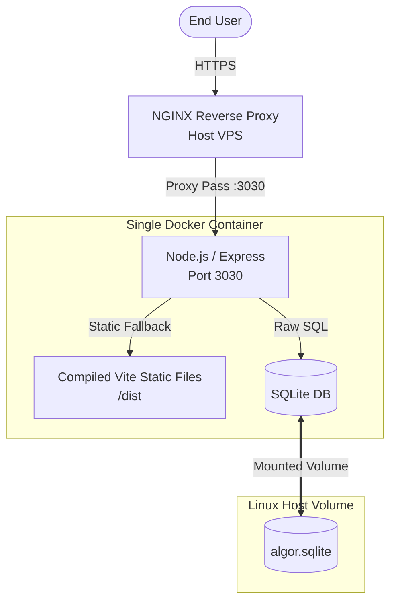

# Architecture Spine — algor

## Design Paradigm
**Monolithic Single-Container Architecture.** The entire application (frontend, backend, and embedded database) runs within a single Docker container to guarantee 100% portability.

## Invariants & Rules

### AD-1 — Single Process Networking (Port 3030)
- **Binds:** Dockerfile, Express Server, NGINX Reverse Proxy configuration.
- **Prevents:** The anti-pattern of running multiple web servers inside a single Docker container (e.g. using supervisord to run Vite + Express on different ports).
- **Rule:** The Node.js (Express) process must listen on a single internal port (`3030`). Express must handle all `/api/*` routes for backend logic, and fallback to serving the compiled static React build (from `/dist`) for all other routes. The host VPS's NGINX will proxy all traffic to `localhost:3030`.

### AD-2 — Embedded Persistence (SQLite)
- **Binds:** Database implementation, Deployment orchestration.
- **Prevents:** The anti-pattern of installing heavy database daemons (MySQL, PostgreSQL) alongside Node.js in the same container.
- **Rule:** Data persistence must be implemented using SQLite running embedded within the Node process.

### AD-3 — Raw SQL Queries
- **Binds:** Backend data access layer.
- **Prevents:** Over-engineering the database access with heavy ORMs for a small footprint application.
- **Rule:** Database interaction must be performed using raw SQL queries via standard SQLite drivers. No ORM (Prisma/TypeORM) is permitted.

### AD-4 — Externalized State via Docker Volumes
- **Binds:** Docker run commands, CI/CD deployment scripts.
- **Prevents:** Data loss when the ephemeral Docker container restarts or updates.
- **Rule:** The SQLite database file must be saved in an internal directory that is mapped to a persistent volume on the host Linux VPS (e.g. `/var/lib/algor-db/`).

## Stack

| Name | Version |
| --- | --- |
| Node.js | v20 LTS |
| React | 18.x (via Vite) |
| Express | 4.x |
| SQLite | 3.x (sqlite3 or better-sqlite3) |
| Docker | Latest |

## Structural Seed



```text
/
  Dockerfile
  package.json
  server/         # Express API routes and Raw SQL queries
  src/            # React frontend source code (Vite)
  dist/           # Compiled React static files (generated during build)
  data/           # Directory for sqlite database (Mounted to Host Volume)
```

## Deferred
- Specific email API provider (e.g., Resend, Sendgrid) can be chosen by the developer during the implementation of the backend notifications module.
